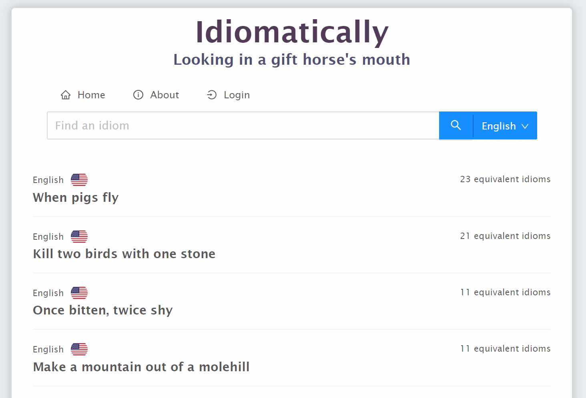
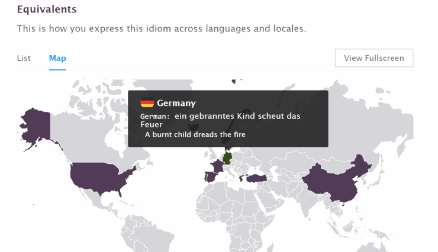
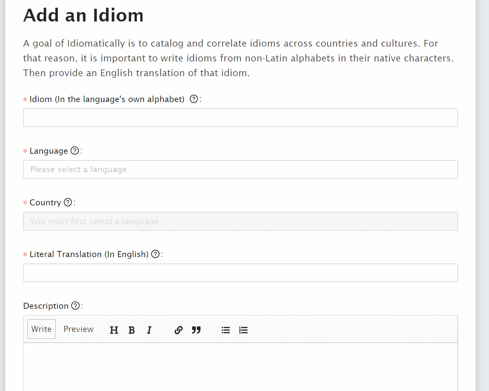

# Idiomatically

[](https://github.com/mmanela/idiomatically/actions?workflow=Node+CI) [](https://github.com/mmanela/idiomatically/actions?workflow=Docker+Image+CI)

## About 
Idiomatically is a site for exploring idioms across languages and locales. 

### Search for idioms and filter by language



### Explore different ways to express an idiom in other languages and locales



### Contribute or update idioms



## Running Locally 

There are a couple options to run locally. Do do iterative development you should run with node locally. But you can also quickly get an instance up with docker.


### Node 

For development you must first set configuration up a configuration file by creating a file `lib/.env.staging.local` that contains filled in settings from [this example file](https://github.com/mmanela/idiomatically/blob/master/lib/.env.example.local). 

Once configured you can run the server and client server to enable iterative development. 

__Server__

`yarn server:start:staging`

__Client__

`yarn client:start`


### Docker

To get it running self-contained you can just use docker-compose which will bootstrap it with a local mongodb instance.

```
docker-compose up --build
```

To stop the service run:
```
docker-compose stop
```
